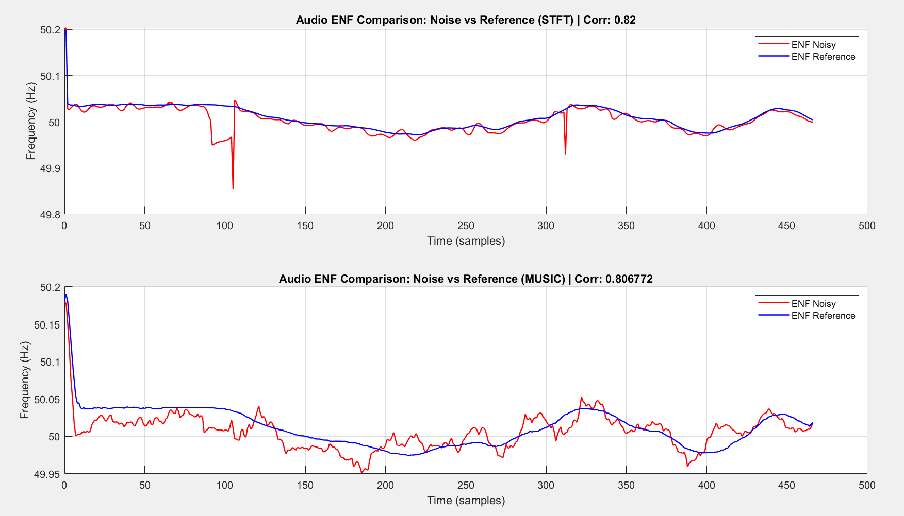
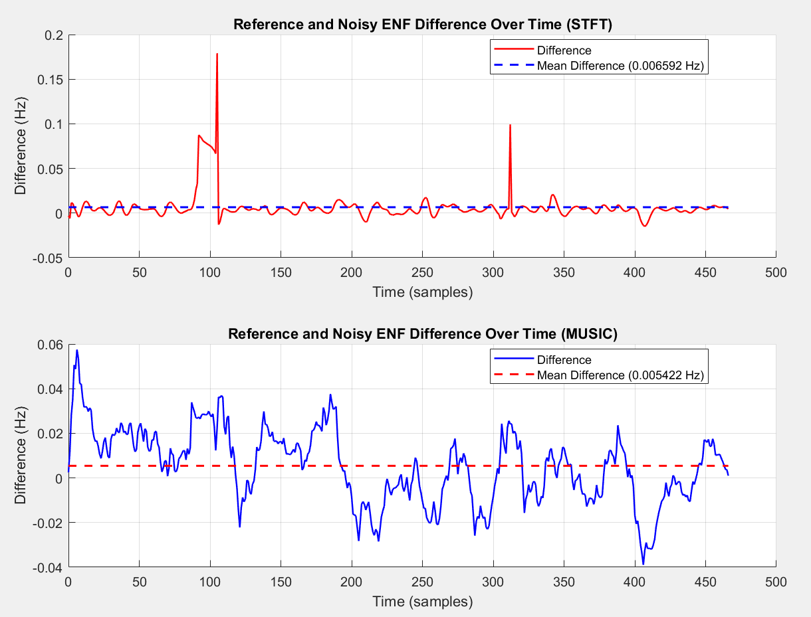
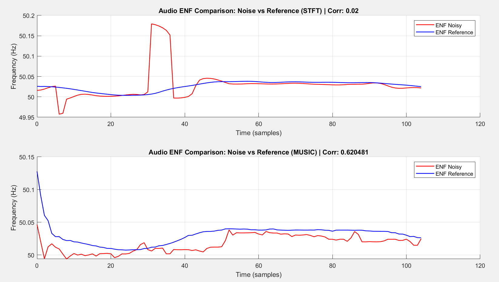
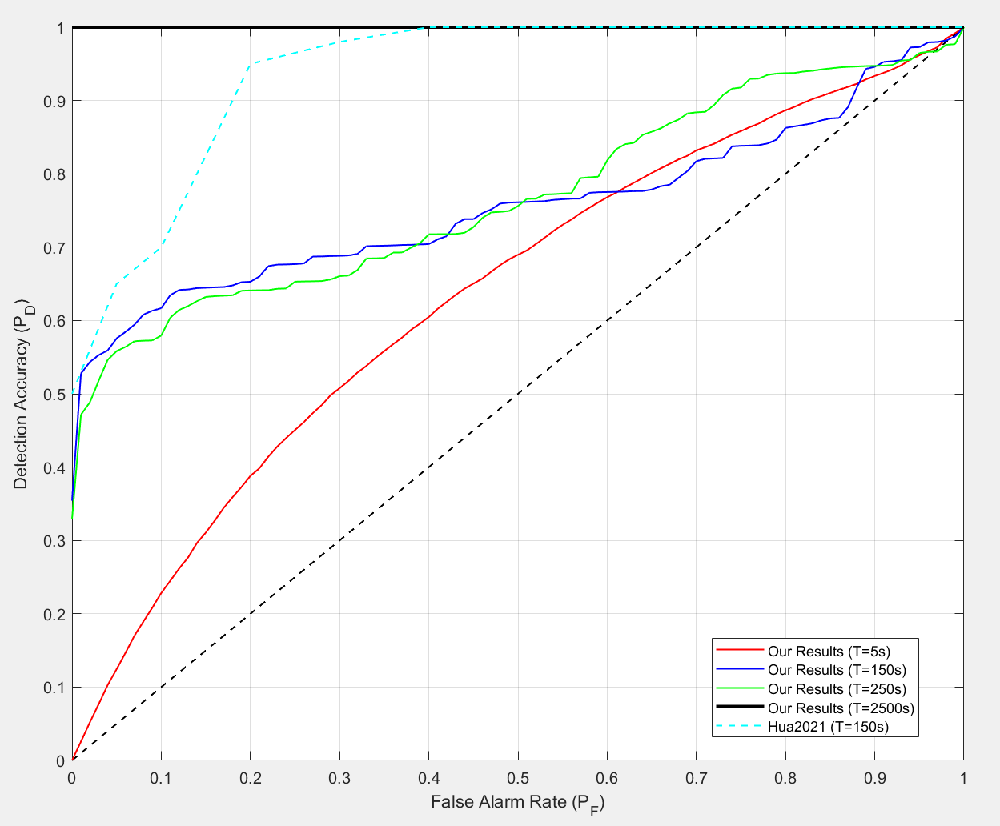
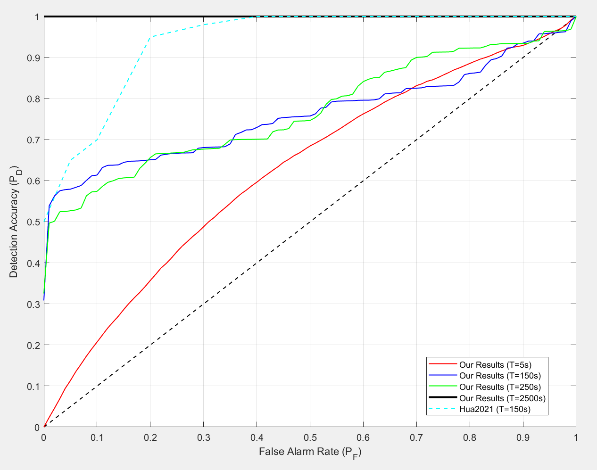

# About
MATLAB implementation of ENF-based audio forensics: extracts ENF from ENF-WHU noisy/reference recordings (https://github.com/ghua-ac/ENF-WHU-Dataset) using STFT+quadratic interpolation and MUSIC, then evaluates synchronization/time-of-recording detection by segment correlation and ROC/AUC analysis, including baseline comparison with Hua et al. (2021) (https://ieeexplore.ieee.org/document/9143185).

## Results

### ENF extraction examples

 

### Detection performance

### AUC / ROC curves

 

